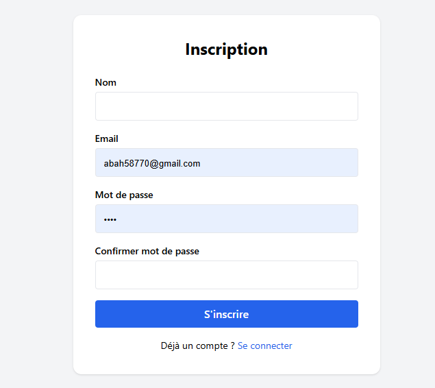
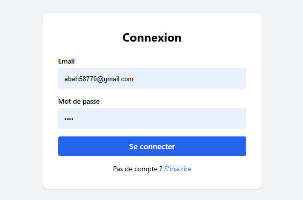
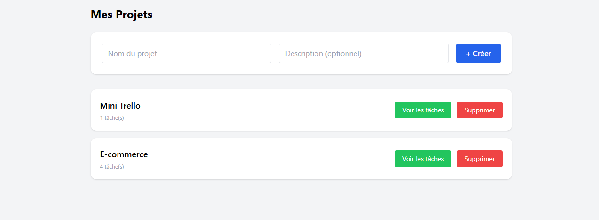
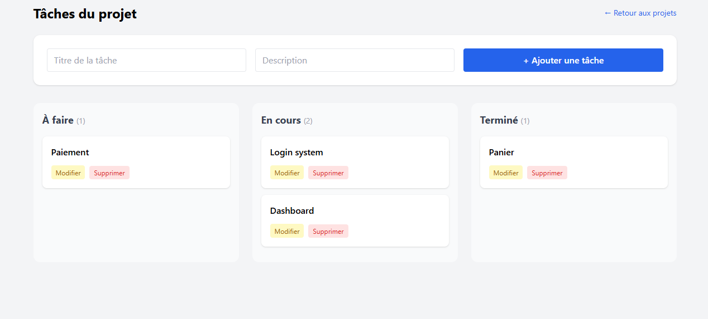

# Mini Trello — Test Technique Full Stack Junior

Application de gestion de tâches inspirée de Trello permettant aux utilisateurs de créer des projets, organiser des tâches et suivre leur progression via une interface simple et intuitive.

---

##  Fonctionnalités

* Création de projets
* Ajout, modification et suppression de tâches
* Gestion du statut des tâches (To Do, In Progress, Done)
* Authentification (login / register)
* Interface simple et responsive avec Tailwind CSS
* Mise à jour dynamique des tâches (AJAX / Fetch API)

---
## 📸 Aperçu
### Inscription

### Connexion

### Projets

### Tâches


##  Stack technique

* **Backend** : Laravel 11 (MVC, Eloquent ORM)
* **Frontend** : Blade + Tailwind CSS
* **Base de données** : MySQL
* **JS** : Vanilla JS (Fetch API)

---

##  Installation

```bash
git clone https://github.com/AmadoukorkaBah-gn/mini-trello.git
cd projettest
composer install
cp .env.example .env
php artisan key:generate
```

Configurer le fichier `.env` :

```
DB_DATABASE=projettest
DB_USERNAME=root
DB_PASSWORD=
```

Puis :

```bash
php artisan migrate
php artisan serve
```

---

##  Architecture & bonnes pratiques

### Clean Code

* Controllers légers (logique déléguée aux Services)
* Nommage clair des méthodes
* Validation via Form Requests

### DRY

* Services centralisent la logique métier
* Repositories pour l’accès aux données
* Layout Blade réutilisable

### SOLID

* **SRP** : séparation claire des responsabilités
* **DIP** : utilisation d’interfaces (Repository Pattern)
* **OCP** : extensible sans modifier le code existant

---

##  Difficultés rencontrées

* Implémentation du drag & drop avec mise à jour asynchrone
* Structuration d’une architecture propre (Services + Repositories)
* Gestion des interactions dynamiques côté frontend

---

##  Améliorations possibles

* Drag & drop avancé (type Trello réel)
* Ajout de notifications en temps réel
* API REST complète + frontend Vue/React
* Gestion multi-utilisateurs et collaboration en temps réel

---
## exercice d'analyse corrigé
1) les problemes dans le code
Le nom de la fonction process n’est pas explicite
Accès direct aux clés (d["status"], d["name"]) → risque d’erreur (KeyError)
Mélange de plusieurs responsabilités (filtrage + transformation)
Code peu lisible (boucle + condition + transformation dans la même fonction)
Logique pas facilement extensible (statut "done" figé)
2) version ameliorée
def get_completed_task_names(tasks):
    return [
        task.get("name", "").upper()
        for task in tasks
        if task.get("status") == "done"
    ]

3) On rend le code extensible en séparant les responsabilités :

def is_task_done(task):
    return task.get("status") == "done"


def format_task_name(task):
    return task.get("name", "").upper()


def get_completed_task_names(tasks):
    return [
        format_task_name(task)
        for task in tasks
        if is_task_done(task)
    ]

## 👨 Auteur

Amadou Korka Bah
